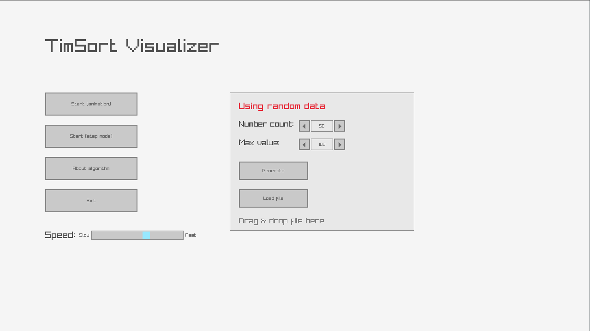

# TimSort Visualizer

Проект визуализации алгоритма сортировки **TimSort** с использованием библиотек `raylib` и `raygui`.
TimSort — это гибридный алгоритм, сочетающий **Insertion Sort** и **Merge Sort**, разработанный для эффективной работы с реальными данными.

 

## 📋 Содержание
- [Зависимости](#-зависимости)
- [Сборка и запуск](#-сборка-и-запуск)
  - [Linux](#-linux)
  - [Arch](#-Arch)
- [Использование](#-использование)
- [Лицензия](#-лицензия)

---
av

## 📦 Зависимости
- **raylib** (>= 4.0.0) — библиотека для графики и ввода.
- **raygui** (>= 3.0) — библиотека для простого GUI.
- **CMake** (>= 3.15) — система сборки.
- **Компилятор C++** (GCC, Clang или MinGW).

### Установка зависимостей
#### Linux (Debian/Ubuntu)
```bash
sudo apt install raylib raygui git gcc
```
#### Arch Linux
```bash
sudo pacman -S cmake raylib raygui git gcc
```
---

## 🛠 Сборка и запуск

1. Клонируйте репозиторий:
   ```bash
   git clone https://github.com/ваш-username/TimSortVisualizer.git
   cd TimSortVisualizer
   ```
2. Соберите проект:
   ```bash
   mkdir build && cd build
   cmake ..
   make -j4
   ```
3. Запустите:
   ```bash
   ./bin/TimSortVisualizer
   ```

---

## 🎮 Использование
- **Главное меню**:
  - `Start (animation)` — запуск анимации сортировки.
  - `Start (step mode)` — пошаговый режим (пространство для следующего шага).
  - `About algorithm` — информация о TimSort.
  - `Exit` — выход из программы.

- **Настройки данных**:
  - Можно загрузить числа из файла (`numbers.txt`) или сгенерировать случайные.
  - Для загрузки файла перетащите его в окно программы.

---

## 📜 Лицензия
Проект распространяется под лицензией **MIT**.
Подробнее см. в файле [LICENSE](LICENSE).

---

### 🔗 Ссылки
- [Raylib](https://www.raylib.com/)
- [TimSort (Wikipedia)](https://en.wikipedia.org/wiki/Timsort)
